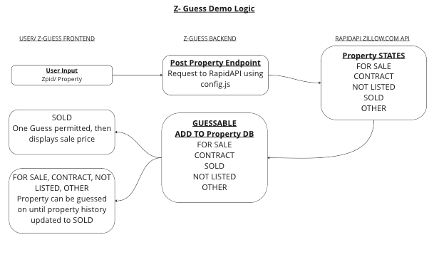
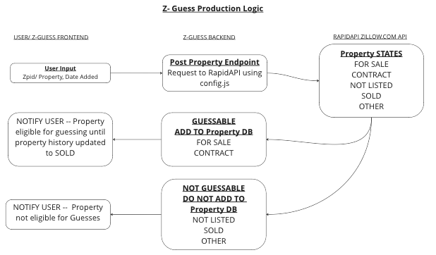
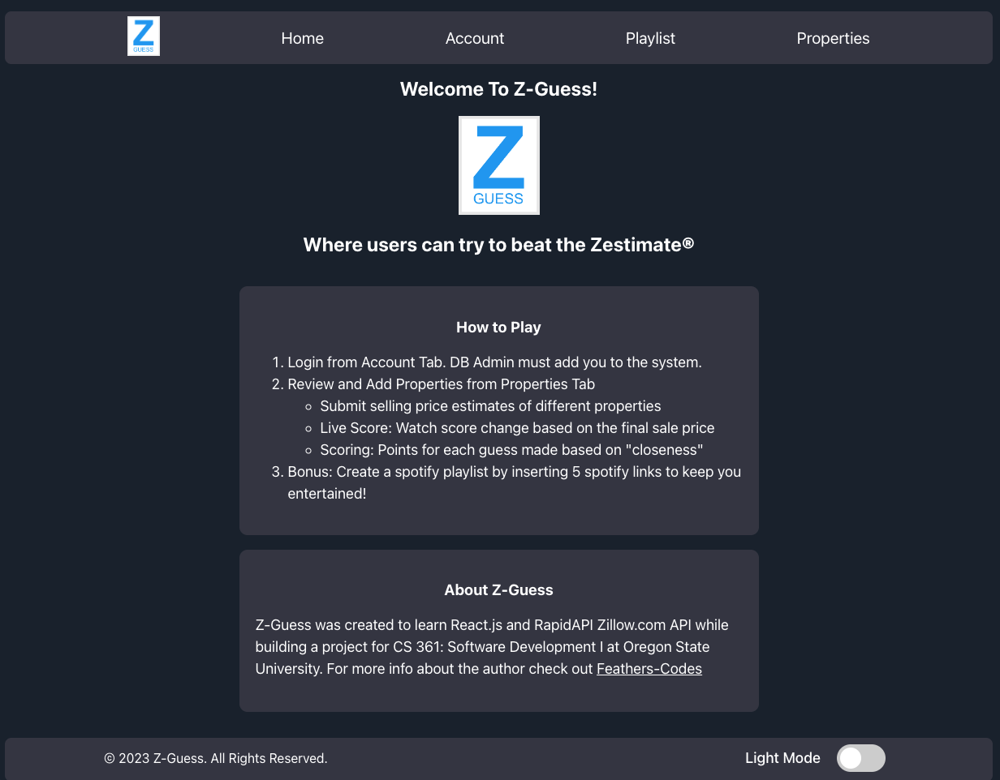
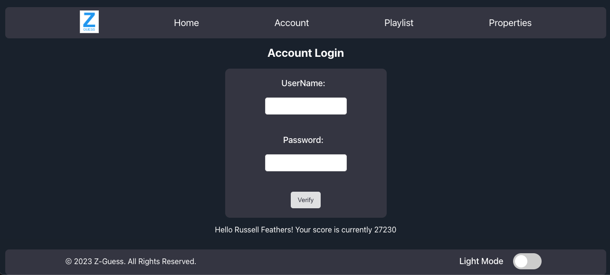
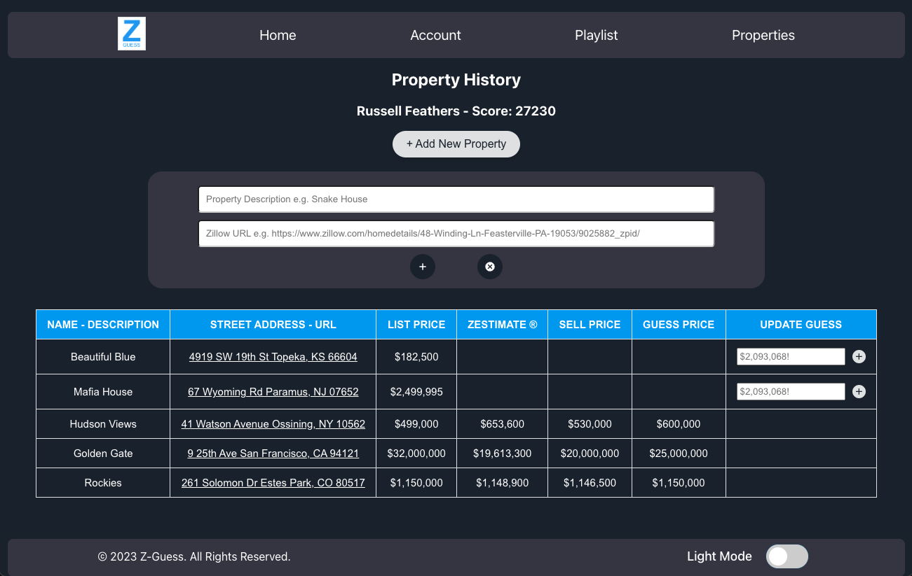
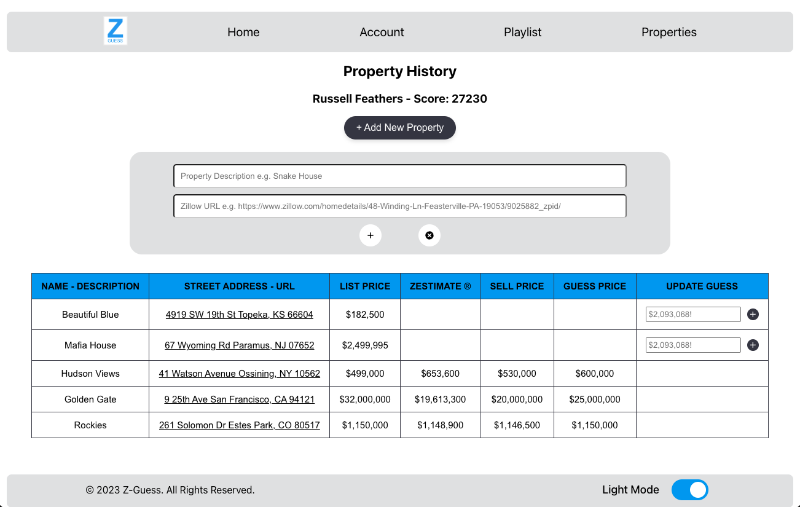

# Z-Guess: Beat the Zestimate!
<div align="center"  style="margin: 20px;">

</div>

Z-Guess enables users to track sell-price estimates for house listings on Zillow and generates a score based on "closeness" to the final sale price. Z-Guess leverages the RapidAPI Zillow.com API to acess real-time data and updates, and stores data in a PostgreSQL database. Developed as part of Software Development I at Oregon State University.

## Technologies
```
FrontEnd: React.js, HTML/CSS
BackEnd: Node.js
DataBase: PostgresSQL (switched from MySQL in 2023)
Cloud: Railway (Postgres), Vercel (Static, Node Server)
```

## Methodology (Demo vs. Production)

Current Design: Demo Logic

<div align="left"  style="margin: 20px;">

</div>

In Development: Production Logic

<div align="left"  style="margin: 20px;">

</div>

## Remaining Items as of 08/2023 
- Shift from Demo to Production Logic (On-going)
- Deployment w/ Limits, Special Accounts
- User Authentication
- Group Competition Logic
- Removal of Spotify Project

## Revamped 08/2023 Screenshots

<div align="left"  style="margin: 20px;">

</div>

<div align="left"  style="margin: 20px;">

</div>

<div align="left"  style="margin: 20px;">

</div>

<div align="left"  style="margin: 20px;">

</div>


## Screen shots from 08/2022 Final Presentation
<div align="left">

</div>
<div align="left">

</div>

## MicroService Integration with Partner Spotify ML App (2022 Version)

### How to Request Data?

Make a GET request with the userName in the url link. UserName must be in the DB system, use featheru for testing purposes

```
serverAddress = http://flip2.engr.oregonstate.edu:6363
GET ${serverAddress}spotifyproperties/{UserName}
```
<div align="left">
    
</div>

### How to Receive Data?

Data returned as JSON from API. If no properties are found the following entry will be returned {Url: "No Properties Found"}

```
json({Url: ?})
```

<div align="left">
    
</div>


